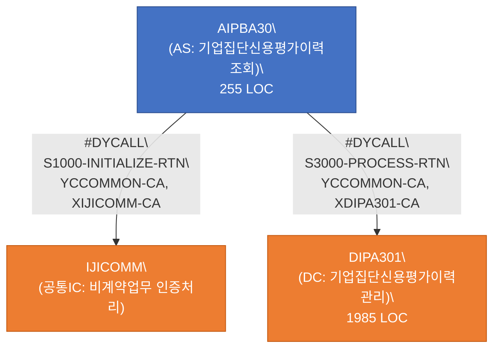
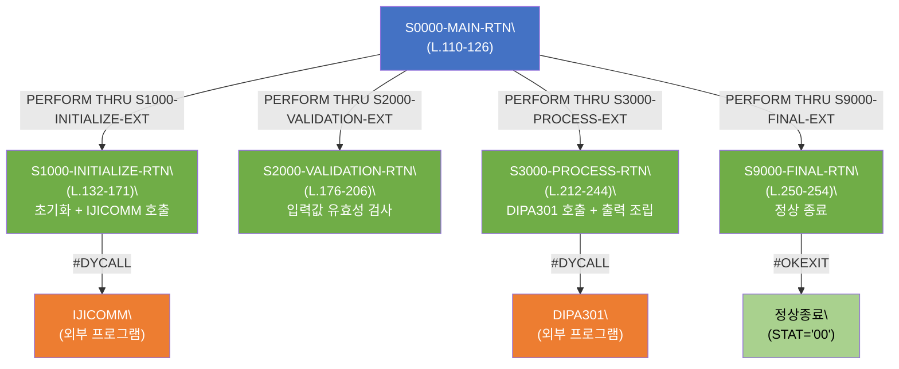
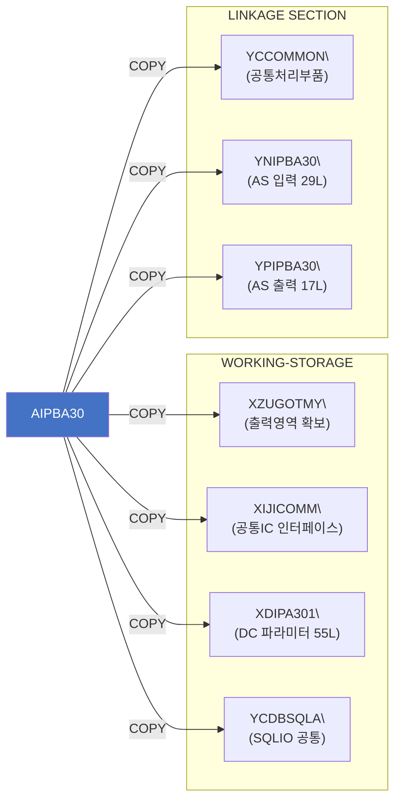

# C2J Pipeline 작업 브리핑

> 작성 기준: `main_v4.py` (백엔드 v4) + `eclipse-plugin_v7` (플러그인 v7)

---

## 1. App 동작방식 & 프레임워크

### 전체 아키텍처

```
┌─────────────────────────────────────────────────────────────────┐
│  Eclipse IDE (eclipse-plugin_v7)                                │
│  ┌─────────────────────────────────────────────────────────┐   │
│  │  DeepAgentsView (SWT)                                   │   │
│  │  ┌─────────────┐  ┌──────────────────────────────────┐  │   │
│  │  │ Project 탭  │  │  Browser (HTML/JS 채팅 렌더링)    │  │   │
│  │  │ Workspace탭 │  │                                  │  │   │
│  │  │ Programs 탭 │  │                                  │  │   │
│  │  └─────────────┘  └──────────────────────────────────┘  │   │
│  │  [입력창________________________] [Send]  [Stop]         │   │
│  └────────────────────────┬────────────────────────────────┘   │
│                   ApiClient (HTTP/SSE)                          │
└───────────────────────────┼─────────────────────────────────────┘
                            │ POST /session/{id}/convert
                            │ POST /session/{id}/message
                            │ SSE 스트리밍 응답
┌───────────────────────────▼─────────────────────────────────────┐
│  FastAPI 서버 (main_v4.py) — Python/DeepAgents SDK             │
│                                                                 │
│  c2j-orchestrator (LangGraph 에이전트)                          │
│  ┌─────────────────────────────────────────────────────────┐   │
│  │  run_pipeline() — 코드 레벨 파이프라인 오케스트레이션    │   │
│  │                                                         │   │
│  │  analysis → planning → conversion → validation          │   │
│  │  → refinement → build → unittest                       │   │
│  │       ↑                      ↓                         │   │
│  │    (retry)     ACE Reflect & Curate                    │   │
│  └─────────────────────────────────────────────────────────┘   │
│                                                                 │
│  서브에이전트들 (각 단계 전문 LLM)                               │
│                                                                 │
│  Neo4j GraphDB  ←→  neo4j_tools.py (검색/의존성 분석)          │
│  Playbooks (/app/c2j-cli-app/playbooks/)  ← ACE 자동 업데이트  │
└─────────────────────────────────────────────────────────────────┘
```

### FastAPI 서버 핵심 개념

| 개념 | 설명 |
|------|------|
| **세션** | user_id 기준 격리, 최대 3개 동시 세션, TTL 1시간 |
| **workdir** | `/data/users/{user_id}/workdir/{program_name}/` — 프로그램별 완전 격리 |
| **공유 playbook** | `/app/c2j-cli-app/playbooks/` — 전체 사용자 공유, Lock 보호 |
| **tool budget** | 세션당 툴 호출 300회 상한 (초과 시 `budget_exceeded` SSE) |
| **interrupt** | write_file/edit_file/execute 툴 호출 시 사용자 승인 대기 |
| **auto_approve** | interrupt 없이 전체 자동 실행 모드 |

### SSE 이벤트 타입

```
token           — LLM 토큰 출력
tool_start      — 툴 호출 시작 (count 포함)
tool_end        — 툴 호출 완료
interrupt       — 승인 대기 → /resume 로 응답
budget_exceeded — 툴 호출 300회 초과
pipeline_stage  — 스테이지 시작/완료 {stage, status, retry, program}
pipeline_retry  — 재시도 시작 {retry, from_stage}
pipeline_halted — 3회 실패 HALT
done            — 전체 완료 {stop_reason, generated_files}
error           — 에러
cancelled       — 사용자 취소
```

### 주요 API 엔드포인트

| 메서드 | 경로 | 설명 |
|--------|------|------|
| GET | `/health` | 서버 상태 |
| GET | `/agents` | 등록 에이전트 목록 |
| POST | `/session` | 세션 생성 |
| DELETE | `/session/{id}` | 세션 종료 |
| POST | `/session/{id}/message` | 자유 텍스트 대화 (SSE) |
| POST | `/session/{id}/convert` | COBOL 전환 요청 (SSE) |
| POST | `/session/{id}/resume` | interrupt 응답 |
| POST | `/session/{id}/cancel` | 실행 중지 |
| GET | `/programs` | GraphDB 프로그램 목록 |
| GET | `/session/{id}/files/{path}` | 변환 결과 파일 조회 |
| GET | `/session/{id}/workspace` | 세션 workdir 파일 목록 |
| DELETE | `/users/{uid}/files/{path}` | 파일/폴더 삭제 |

---

## 2. 에이전트 동작방식, 참고자료, 출력물

### 에이전트 구성

```
c2j-orchestrator  ← 파이프라인 전체 총괄 (AGENTS.md 기반)
│
├── analysis-agent       (1단계)
├── planning-agent       (2단계)
├── conversion-agent     (3단계)
├── validation-agent     (4단계)
├── refinement-agent     (5단계)
├── build-agent          (6단계)
├── unittest-agent       (7단계)
├── ace-reflector-agent  (ACE: 실패/성공 분석)
├── ace-curator-agent    (ACE: playbook 업데이트)
└── graphdb-search-agent (공통: GraphDB 조회 전담)
```

> GraphDB 접근이 필요한 에이전트(analysis, planning, conversion, graphdb-search)에는 `neo4j_tools` 직접 바인딩.

### 에이전트별 참고자료 출처

> **범례**
> - `[DB]` = Neo4j GraphDB (graphdb-search-agent를 task로 호출하여 조회)
> - `[로컬]` = workdir 아래 로컬 파일 (read_file 도구로 직접 읽기)
> - `[공유]` = 서버 공유 Playbook (`/app/c2j-cli-app/playbooks/`)

---

#### 1. analysis-agent
- **역할**: COBOL 소스 정적 분석
- **참고자료**:

  | 출처 | 항목 | 비고 |
  |------|------|------|
  | `[DB]` | `CobolFrameworkRule` | z-KESA 프레임워크 규칙 전체 |
  | `[DB]` | `CommonUtility` + `CONVERTS_TO→JavaUtility` | 공통 모듈 매핑 |
  | `[DB]` | `SqlTable` | DB 테이블 스키마 + 접근 프로그램 목록 |
  | `[DB]` | `MappingRule` (전체) | mapping_status 포함 |
  | `[DB]` | `MappingRule` (status=X/-) | 미구현 유틸리티 — 위험도 상(HIGH) 분류 기준 |
  | `[DB]` | `CobolProgram` | 소스 content, program_type |
  | `[DB]` | `CobolParagraph` | 단락 전체 |
  | `[DB]` | `CobolCopybook` | COPY 문 참조 시 동적 탐색 |

- **출력물** `[로컬]`: `{program}/output/analysis_spec.md`
  - 프로그램 구조, DB 연동, 비즈니스 로직, 데이터 타입 매핑 테이블
  - 변환 위험도 분류 (상/중/하), Mermaid Call Graph

---

#### 2. planning-agent
- **역할**: Java 변환 설계서 작성
- **참고자료**:

  | 출처 | 항목 | 비고 |
  |------|------|------|
  | `[DB]` | `JavaUtility` | n-KESA Java 유틸리티 목록 |
  | `[DB]` | `CommonUtility CONVERTS_TO→JavaUtility` | 공통 모듈 매핑 |
  | `[DB]` | `CobolFrameworkRule` | z-KESA 프레임워크 규칙 |
  | `[DB]` | `MappingRule` (전체) | 매핑 현황 |
  | `[DB]` | `MappingRule` (status=X/-) | 미구현 — 대체 전략 수립 필수 |
  | `[DB]` | `ConversionRule` (ARCH_LAYER, NAMING_CONVENTION) | 계층 매핑·명명 규칙 설계 근거 |
  | `[DB]` | `ReferenceChunk`, `ReferenceDocument` | 변환 패턴 참조 문서 |
  | `[로컬]` | `output/analysis_spec.md` | 1단계 산출물 (read_file) |

- **출력물** `[로컬]`: `{program}/output/conversion_plan.md`
  - nKESA 계층 구조 매핑 (PU/FU/DU), 클래스/메서드 설계, 리스크 항목

---

#### 3. conversion-agent
- **역할**: COBOL → nKESA Java 소스 생성
- **참고자료**:

  | 출처 | 항목 | 비고 |
  |------|------|------|
  | `[DB]` | `JavaUtility` | n-KESA 유틸리티 목록 |
  | `[DB]` | `JavaFrameworkRule` | n-KESA 프레임워크 규칙 (코드 생성 기준) |
  | `[DB]` | `ConversionRule` (전체) | 코드 생성 패턴 기준 |
  | `[DB]` | `CommonUtility CONVERTS_TO→JavaUtility` | 공통 모듈 매핑 |
  | `[DB]` | `CommonUtility FieldMapping` (HAS_INPUT/OUTPUT_FIELD) | 정확한 IDataSet java_key 확인 |
  | `[DB]` | `MappingRule` (전체) | 매핑 현황 |
  | `[DB]` | `MappingRule` (status=X/-) | 호출 금지 목록 → TODO 주석 처리 |
  | `[DB]` | `ReferenceChunk`, `ReferenceDocument` | 변환 패턴 참조 문서 |
  | `[로컬]` | `output/conversion_plan.md` | 2단계 산출물 |
  | `[로컬]` | `output/analysis_spec.md` | 1단계 산출물 |
  | `[로컬]` | `output/ace_reflections.md` | 재시도 시 반영 (있을 경우) |

- **출력물** `[로컬]`: `{program}/source/**/*.java`, `output/conversion_log.md`

---

#### 4. validation-agent
- **역할**: 생성된 Java 소스 정적 분석 (읽기 전용)
- **참고자료**:

  | 출처 | 항목 | 비고 |
  |------|------|------|
  | `[DB]` | `JavaFrameworkRule` | n-KESA 검증 기준 (어노테이션/계층 구조) |
  | `[DB]` | `CobolFrameworkRule CORRESPONDS_TO→JavaFrameworkRule` | z↔n-KESA 규칙 대응 |
  | `[DB]` | `ConversionRule` (전체) | 명명/구조/에러처리 검증 기준 |
  | `[DB]` | `MappingRule` (status=O/△) | 구현 가능 유틸리티 목록 |
  | `[DB]` | `MappingRule` (status=X/-) | 호출 금지 유틸리티 — 위반 탐지 |
  | `[로컬]` | `output/conversion_log.md` | 변환 이력 |
  | `[로컬]` | `output/analysis_spec.md` | 원본 COBOL 로직 참조 |
  | `[로컬]` | `source/**/*.java` | 검증 대상 Java 파일들 |

- **출력물** `[로컬]`: `{program}/output/validation_report.md`

---

#### 5. refinement-agent
- **역할**: 보고서 피드백 기반 Java 소스 수정 (보고서 명시 항목만)
- **참고자료**:

  | 출처 | 항목 | 비고 |
  |------|------|------|
  | `[DB]` | `JavaFrameworkRule` | 수정 기준 규칙 |
  | `[DB]` | `ConversionRule` (전체) | 올바른 변환 패턴 확인 |
  | `[DB]` | `CommonUtility FieldMapping` | 공통 유틸 관련 오류 시 java_key 확인 |
  | `[공유]` | `playbook-build.md`, `playbook-validation.md`, `playbook-test.md` | 수정 가이드 |
  | `[로컬]` | `output/validation_report.md` or `test_report.md` or `build_result.md` | 수정 근거 보고서 |
  | `[로컬]` | `output/ace_reflections.md` | 재시도 시 반드시 반영 |
  | `[로컬]` | `source/**/*.java` | 수정 대상 파일들 |

- **출력물** `[로컬]`: 수정된 `source/**/*.java`, `output/refinement_log.md`

---

#### 6. build-agent
- **역할**: Maven/Gradle 빌드 실행
- **참고자료**:

  | 출처 | 항목 | 비고 |
  |------|------|------|
  | `[DB]` | n-KESA 가이드, 공통 모듈 가이드 | graphdb-search-agent 호출 |
  | `[공유]` | `playbook-build.md` | 빌드 가이드 |
  | `[로컬]` | `output/refinement_log.md` | 존재 시 참조 |
  | `[로컬]` | `pom.xml` / `build.gradle` | 빌드 설정 |
  | `[로컬]` | `source/**/*.java` | 빌드 대상 소스 |

- **출력물** `[로컬]`: `{program}/output/build_result.md`
  - `Overall Result**: SUCCESS/FAIL` — 서버 코드가 직접 파싱하여 성공 판정

---

#### 7. unittest-agent
- **역할**: JUnit5 + Mockito 단위 테스트 작성 및 실행
- **참고자료**:

  | 출처 | 항목 | 비고 |
  |------|------|------|
  | `[DB]` | n-KESA 가이드, 공통 모듈 가이드 | graphdb-search-agent 호출 |
  | `[DB]` | `SqlTable` | DB 테이블 스키마 — Mock 데이터 설계 |
  | `[공유]` | `playbook-test.md` | 테스트 가이드 |
  | `[로컬]` | `output/analysis_spec.md` | COBOL 원본 비즈니스 로직 — 등가 검증 기준 |
  | `[로컬]` | `source/**/*.java` | 테스트 대상 소스 |

- **출력물** `[로컬]`: 테스트 클래스 파일들, `{program}/output/test_report.md`
  - `Overall Result**: PASS/FAIL` — 서버 코드가 직접 파싱하여 성공 판정

---

#### 8. ace-reflector-agent (ACE 패턴)
- **역할**: 실패/성공 trajectory 분석 → 근본 원인 + playbook 개선안 도출
- **참고자료** (모두 `[로컬]` + `[공유]`, GraphDB 미참조):

  | 출처 | 항목 |
  |------|------|
  | `[로컬]` | `output/build_result.md` |
  | `[로컬]` | `output/test_report.md` |
  | `[로컬]` | `output/validation_report.md` |
  | `[로컬]` | `output/refinement_log.md` |
  | `[로컬]` | `output/conversion_log.md` |
  | `[로컬]` | `output/conversion_plan.md` |
  | `[공유]` | `playbook-build.md`, `playbook-test.md`, `playbook-validation.md` |

- **동작 방식**:
  1. 로컬 보고서 + 공유 Playbook 전체 읽기
  2. 에러를 7개 카테고리로 분류 (`COMPILE_ERROR` / `RUNTIME_ERROR` / `TEST_FAILURE` / `LOGIC_MISMATCH` / `CONVENTION_VIOLATION` / `SECURITY_ISSUE` / `DESIGN_FLAW`)
  3. 에러별 5-point 근본 원인 분석 수행
     - **What failed** — 실패한 구체적 동작
     - **Where** — 파일명, 라인, 메소드
     - **Why** — 근본 원인 (표면적 원인이 아닌 진짜 원인)
     - **Contributing factors** — 기여 요인
     - **Prevention** — 향후 방지 방법
  4. 기존 Playbook 룰과 매칭하여 delta 제안 생성
     - 도움된 룰 → `helpful +1` 제안
     - 해로운 룰 → `harmful +1` 제안
     - 신규 패턴 → `ADD` 제안
  5. `ace_reflections.md` 작성 (ace-curator-agent로 전달)
  - **실행 모드**: FAILURE(실패 분석) / SUCCESS(성공 패턴 학습) — 성공 시에도 항상 실행
- **출력물** `[로컬]`: `{program}/output/ace_reflections.md`

---

#### 9. ace-curator-agent (ACE 패턴)
- **역할**: ace_reflections.md의 delta를 실제 playbook에 반영
- **참고자료** (모두 `[로컬]` + `[공유]`, GraphDB 미참조):

  | 출처 | 항목 |
  |------|------|
  | `[로컬]` | `output/ace_reflections.md` |
  | `[공유]` | `playbook-build.md`, `playbook-test.md`, `playbook-validation.md` |

- **동작 방식**:
  1. `ace_reflections.md`의 delta 제안을 3가지 operation으로 처리

     | Operation | 동작 |
     |-----------|------|
     | `ADD` | 새 RULE ID 생성 후 해당 playbook에 룰 추가 (helpful:1, harmful:0 초기화) |
     | `UPDATE (helpful +1)` | 기존 룰의 helpful 카운터 증가 |
     | `FLAG_HARMFUL` | 기존 룰의 harmful 카운터 증가, harmful > helpful이면 `⚠️ FLAGGED` 태그 |

  2. 중복 검사 — 새 룰 패턴이 기존 룰과 80% 이상 유사하면 추가 대신 병합
  3. Playbook 파일 업데이트 (asyncio Lock으로 동시 쓰기 충돌 방지)
  4. `ace_curation_log.md` 작성
  - **원칙**: 룰은 삭제하지 않음 (Grow-and-Refine) — harmful이 높아도 FLAGGED 처리만, 시간이 지나며 자연 정제
- **출력물**: 업데이트된 `[공유]` `playbook-*.md`, `[로컬]` `output/ace_curation_log.md`

---

#### 10. graphdb-search-agent
- **역할**: Neo4j GraphDB 전용 조회 서브에이전트 (다른 에이전트에서 `task` 도구로 호출)
- **사용 도구**: `search_cobol_by_keyword`, `run_cypher_query`, `get_cobol_dependencies`, `search_reference_documents`
- **캐시**: 세션 스코프 `GraphDBCache` — 동일 쿼리 중복 호출 방지
- **GraphDB 노드 목록**:

  | 노드 | 주요 내용 |
  |------|----------|
  | `CobolProgram` | COBOL 소스 content, 구조 메타데이터 |
  | `CobolParagraph` | 단락별 content, 라인 범위 |
  | `CobolCopybook` | Copybook 내용 |
  | `SqlTable` | DB 테이블 스키마 |
  | `CommonUtility` | z-KESA 공통 모듈 정보 |
  | `CobolFrameworkRule` | z-KESA 프레임워크 규칙 |
  | `JavaFrameworkRule` | n-KESA Java 프레임워크 규칙 (59개) |
  | `JavaUtility` | n-KESA Java 유틸리티 |
  | `MappingRule` | COBOL→Java 매핑 상태 (O/△/X/-) |
  | `ConversionRule` | 코드 생성 패턴·계층·명명 규칙 |
  | `FieldMapping` | CommonUtility INPUT/OUTPUT 필드 키 |
  | `ReferenceDocument` / `ReferenceChunk` | 변환 참조 문서 |

### 재시도 로직 (코드 레벨 오케스트레이션)

```
Phase 1: analysis → planning → conversion → validation → refinement
         └─ 스테이지 실패 시 즉시 중단 (pipeline_halted)

Phase 2: build → unittest
         └─ 성공: ACE Reflect/Curate → 완료
         └─ 실패 → retry_count += 1
                   ACE Reflect/Curate (항상 실행)
                   1차: refinement 부터 재실행
                   2차: conversion 부터 재실행
                   3차: planning 부터 재실행
                   3회 모두 실패 → build_error.md 생성 → pipeline_halted
```

> 재시도/상태 판정은 **Python 코드가 직접** 담당 (LLM 판단 의존 제거).  
> 성공 판정: `build_result.md`에 `Overall Result**: SUCCESS` 포함 여부로 파싱.

---

### ACE (Agentic Context Engineering) 구조

#### 설계 목적

처음 전환 시 품질이 완벽하지 않더라도, 전환을 반복할수록 **같은 실패를 반복하지 않도록** 스스로 개선하는 자기 학습 프레임워크.

- 전환 실패/성공 → 원인 분석 → 공유 Playbook에 룰 축적 → 다음 전환 시 에이전트가 참조
- 프로그램 A의 실패가 프로그램 B 전환 품질을 높이는 **크로스 프로그램 학습**

#### 학습 사이클

```
                    ┌─────────────────────────────────────────────┐
                    │           공유 Playbook (서버 전역)           │
                    │  playbook-build.md      (빌드 실패 패턴)     │
                    │  playbook-validation.md (nKESA 위반 패턴)   │
                    │  playbook-test.md       (테스트 실패 패턴)   │
                    │                                             │
                    │  ### RULE-BLD001                           │
                    │  - helpful: 5  / harmful: 1               │
                    └──────────┬──────────────────▲──────────────┘
                               │ 읽기               │ 쓰기
              ┌────────────────▼───┐         ┌─────┴──────────────┐
              │  planning-agent    │         │  ace-curator-agent  │
              │  conversion-agent  │         │  (delta 반영)       │
              │  refinement-agent  │         └─────▲──────────────┘
              │  build-agent       │               │ ace_reflections.md
              │  unittest-agent    │         ┌─────┴──────────────┐
              └────────────────────┘         │  ace-reflector-agent│
                                             │  (실패/성공 분석)   │
              build/test 결과 ───────────────►  5-point RCA        │
              (SUCCESS or FAIL)              │  에러 분류          │
                                             │  delta 제안 생성    │
                                             └────────────────────┘
```

#### 트리거 시점

| 상황 | ACE 동작 |
|------|----------|
| build/test **실패** | Reflect(FAILURE 모드) → Curate → 재시도 |
| build/test **성공** | Reflect(SUCCESS 모드) → Curate → 완료 |
| Phase 1 실패 (분석/설계/변환) | ACE 미동작 (pipeline_halted) |

#### Playbook 룰 구조

```markdown
### RULE-BLD001
- **pattern**: import 누락으로 인한 컴파일 에러
- **cause**: DU 클래스에서 IDataSet import 생략
- **helpful**: 5       <- 이 룰이 도움된 횟수
- **harmful**: 1       <- 이 룰이 오히려 해가 된 횟수
- **auto_recoverable**: true
- **recovery_agent**: refinement-agent
- **auto_actions**:
  1. import nexcore.framework.core.data.IDataSet 추가
```

- **helpful > harmful**: 유효한 룰, 에이전트가 우선 적용
- **harmful > helpful**: `⚠️ FLAGGED` 태그, 에이전트가 적용 회피
- **룰은 삭제하지 않음**: 카운터로만 품질 관리 (Grow-and-Refine 원칙)

#### 에이전트별 Playbook 활용

| 에이전트 | 읽는 Playbook | 활용 방식 |
|----------|--------------|----------|
| planning-agent | validation + build | 설계 단계에서 반복 위반 패턴 원천 차단 |
| conversion-agent | validation + build + test | 코드 생성 시 실패 유발 패턴 회피 |
| refinement-agent | validation + build + test | 수정 방향 결정 |
| build-agent | build | 빌드 환경 설정 가이드 |
| unittest-agent | test | 테스트 작성 가이드 |
| ace-reflector-agent | 전체 (읽기) | 기존 룰과 새 실패 매칭 |
| ace-curator-agent | 전체 (읽기+쓰기) | delta 반영, 카운터 업데이트 |

#### 크로스 프로그램 학습 흐름 예시

```
프로그램 A 전환
  └─ build 실패: "DU 클래스에 @BizUnit 어노테이션 누락"
      └─ ace-reflector → ace-curator → playbook-validation.md에 RULE-VAL005 추가

프로그램 B 전환 (이후)
  └─ conversion-agent가 playbook-validation.md 읽음
      └─ RULE-VAL005 확인 → @BizUnit 어노테이션 처음부터 정확히 생성
          └─ build 성공 (같은 실패 반복 없음)
```

---

## 3. Plugin과 앱의 동작 방식

### Eclipse Plugin (eclipse-plugin_v7) 구조

```
com.deepagents.cli/
├── views/DeepAgentsView.java    — SWT 메인 뷰 (UI 전체)
├── util/ApiClient.java          — HTTP/SSE 클라이언트 (표준 라이브러리만)
├── util/HtmlRenderer.java       — Browser 영역 HTML/JS 렌더링
├── model/ConversionRequest.java — 전환 요청 모델
├── handlers/
│   ├── RunSelectionHandler.java — 우클릭 메뉴 "C2J 전환"
│   └── OpenViewHandler.java     — 뷰 열기 커맨드
└── preferences/                 — API URL, User ID, Auto-approve 설정
```

### 플러그인 UI 구성

```
┌──────────────────────────────────────────────────────┐
│ [Auto-approve] [Refresh] [Clear] [Stop] [New Session] │
│  ● Session Active                         tools: 42  │
├──────────────┬───────────────────────────────────────┤
│ Project 탭   │                                       │
│ ☑ src/       │  채팅 영역 (Browser — HTML/JS)         │
│  ☑ Main.java │  - LLM 토큰 스트리밍 렌더링            │
│  ☐ Test.java │  - 툴 호출 표시 (스피너)               │
│ Workspace 탭 │  - Interrupt 패널 (Approve/Reject)    │
│ (서버 파일)  │  - 파이프라인 단계 진행 표시           │
│ Programs 탭  │                                       │
│ (GraphDB 목록)│                                      │
├──────────────┴───────────────────────────────────────┤
│ 📎 2개 파일: Main.java, Util.java        [첨부 해제]  │
│ [질문 입력창_______________________________] [Send]  │
└──────────────────────────────────────────────────────┘
```

### 플러그인 동작 흐름

```
1. 플러그인 로드
   └─ checkServerAndInitSession()
       ├─ GET /health → 연결 확인
       └─ POST /session → 세션 생성 (User ID 자동 정제)

2. COBOL 전환 요청
   ├─ Programs 탭에서 프로그램 선택 또는 COBOL 파일 우클릭
   ├─ Auto-approve 설정에 따라 confirm 패널 표시
   └─ POST /session/{id}/convert (ConversionRequest JSON)
       └─ SSE 스트리밍 수신
           ├─ token → Browser.execute(HtmlRenderer.appendToken())
           ├─ tool_start/end → 툴 호출 UI 표시
           ├─ pipeline_stage → 진행 상태 표시
           ├─ interrupt → showInterruptPanel() → Approve/Reject
           └─ done → generated_files 목록 수신
               └─ GET /session/{id}/files/{path} → 파일 내용 조회
                   └─ IFile.create() → Eclipse 워크스페이스에 저장

3. 자유 메시지 전송 (파일 첨부)
   ├─ Project 탭에서 파일 체크
   ├─ 입력창에 질문 입력 → Send
   ├─ buildFileContext() — 체크된 파일 내용 읽기 (최대 100KB/파일)
   └─ POST /session/{id}/message (메시지 + 파일 내용 첨부)

4. Interrupt 처리
   ├─ SSE interrupt 이벤트 수신
   ├─ showInterruptPanel() — Approve / Reject 버튼 표시
   └─ POST /session/{id}/resume {"decisions":[{"type":"approve"}]}

5. Workspace 탭
   ├─ GET /session/{id}/workspace → 서버 파일 트리 표시
   ├─ 더블클릭 → GET /session/{id}/files/{path} → Eclipse 에디터로 열기
   ├─ 우클릭 "저장" → 폴더 전체 일괄 다운로드
   └─ 우클릭 "삭제" → DELETE /users/{uid}/files/{path}
```

### 세션 격리 모델

| 구분 | 공유 | 격리 |
|------|------|------|
| 에이전트 프롬프트/설정 | 서버 시작 시 1회 로드 | — |
| 에이전트 인스턴스 | — | 세션별 생성 |
| LangGraph Checkpointer | — | 세션별 독립 |
| workdir | — | `/data/users/{uid}/workdir/` |
| 산출물 | — | `{program}/output/`, `{program}/source/` |
| Playbook | 전체 공유 (Lock) | — |
| GraphDB 캐시 | — | 세션 스코프 |

### 병렬 전환

`ConversionRequest.programs` 배열에 복수 프로그램 지정 시:
- 프로그램별 **독립 에이전트 인스턴스** 생성
- asyncio 백그라운드 태스크로 동시 실행
- 상태는 `GET /session/{id}` → `jobs` 필드로 확인

---

## 4. 추후 보강 사항

### 기능/성능

| 우선순위 | 항목 | 내용 |
|----------|------|------|
| 높음 | **GraphDB 스키마 확장** | `CobolFrameworkRule`, `JavaFrameworkRule`, `ConversionRule`, `FieldMapping` 노드 데이터 실제 적재 여부 검증 — 에이전트가 참조하지만 데이터가 없으면 분석이 제한됨 |
| 높음 | **Playbook 초기화** | `playbook-build.md`, `playbook-test.md`, `playbook-validation.md` 초기 내용 작성 — ACE가 학습 전에는 빈 파일 |
| 높음 | **build/test 스크립트** | build-agent / unittest-agent가 실제 실행하는 Maven 빌드 환경 (JDK, pom.xml 템플릿) 구성 필요 |
| 중간 | **병렬 전환 SSE** | 복수 프로그램 병렬 전환 시 진행상황을 실시간 스트리밍하는 채널 없음 — 현재는 폴링으로만 확인 |
| 중간 | **세션 영속성** | 서버 재시작 시 세션 소멸 — Redis/DB 기반 세션 저장 |
| 중간 | **인증/인가** | API 서버에 인증이 없음 — 토큰 기반 인증 추가 (폐쇄망 외 배포 시 필수) |
| 낮음 | **tool budget 동적 조절** | 프로그램 규모에 따라 budget 자동 산정 (LOC 기반) |
| 낮음 | **GraphDB 캐시 TTL** | 현재 세션 스코프 — 서버 레벨 캐시로 확장 시 성능 향상 |

### Plugin

| 우선순위 | 항목 | 내용 |
|----------|------|------|
| 높음 | **파이프라인 진행 UI** | `pipeline_stage` 이벤트를 Progress Bar / 단계별 체크리스트로 시각화 |
| 높음 | **Diff 뷰** | 전환된 Java 파일을 원본 COBOL과 나란히 비교하는 Diff 에디터 |
| 중간 | **복수 프로그램 선택** | Programs 탭에서 체크박스로 복수 선택 → 병렬 전환 요청 |
| 중간 | **산출물 뷰어** | `analysis_spec.md`, `conversion_plan.md` 등 마크다운 파일 인라인 렌더링 |
| 중간 | **에러 표시 개선** | `build_error.md` 내용을 UI에서 파싱하여 에러 위치 하이라이트 |
| 낮음 | **오프라인 감지** | 서버 연결 끊김 시 자동 재연결 시도 |
| 낮음 | **설정 Export/Import** | API URL / User ID 설정 파일로 내보내기 |

### 아키텍처

| 항목 | 내용 |
|------|------|
| **LLM 모델 교체** | 현재 `anthropic:claude-sonnet-4-6` 고정 — `ChatFabrixModel` 주석 해제로 사내 모델 전환 가능하도록 코드 준비됨 |
| **ACE 플레이북 검증** | ACE가 자동으로 수정한 playbook 내용의 품질 검증 로직 없음 — 이상 패턴 감지 필요 |
| **재시도 복구 전략 고도화** | 현재 retry_count 기반 고정 복구 지점 — ace_reflections.md 분석 결과를 실제 복구 지점 결정에 반영 |
| **단위 테스트 커버리지** | FastAPI 엔드포인트 및 파이프라인 로직에 대한 자동화 테스트 없음 |




### 7.2 내부 PERFORM 흐름 (Intra-program)



### 7.3 Copybook 의존성


